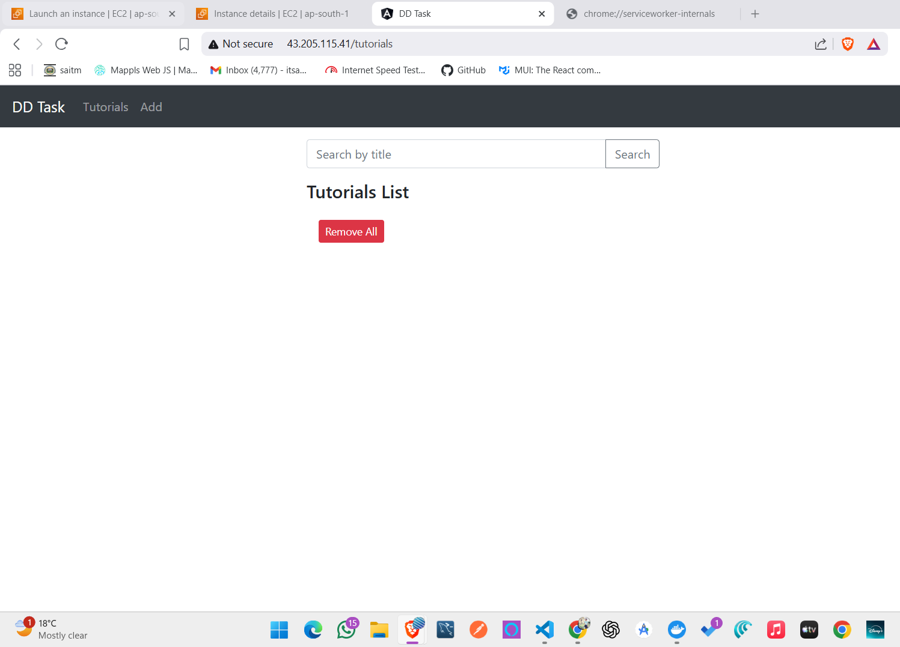
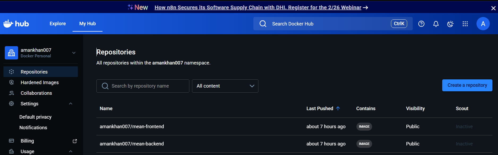
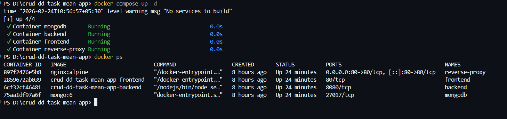
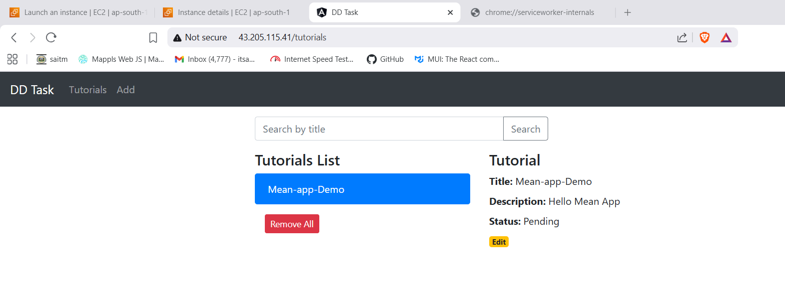
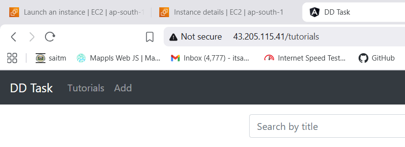
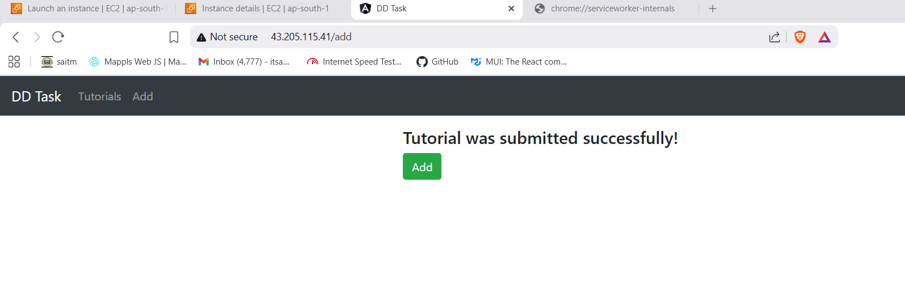

# 📌 MEAN Stack CRUD Application - DevOps Deployment

## 🚀 Project Overview
This project demonstrates the containerization, orchestration, and cloud deployment of a full-stack MEAN (MongoDB, Express, Angular, Node.js) CRUD application for tutorial management.

### 📋 Application Features
- Create Tutorial
- Retrieve All Tutorials  
- Retrieve Single Tutorial
- Update Tutorial
- Delete Tutorial
- Search Tutorials by Title

---

## 🏗️ Architecture Overview

User
│
▼
Nginx (Reverse Proxy - Port 80)
│
├──► Frontend (Angular - Nginx Container)
│
└──► Backend (Node.js + Express API Container)
│
▼
MongoDB Container


---

## 🛠️ Technology Stack

| Layer | Technology |
|-------|------------|
| **Frontend** | Angular 15 (served via Nginx) |
| **Backend** | Node.js + Express |
| **Database** | MongoDB |
| **Reverse Proxy** | Nginx |
| **Containerization** | Docker |
| **Orchestration** | Docker Compose |
| **Cloud** | AWS EC2 (Ubuntu) |
| **CI/CD** | GitHub Actions |
| **Image Registry** | Docker Hub |

---

## 📦 Containerization Details

### Backend Container
- **Build**: Multi-stage Docker build
- **Build Stage**: Node 18 Alpine
- **Runtime**: Distroless Image
- **Port**: 8080
- **Database Connection**: `mongodb://mongodb:27017/dd_db`
- **Network**: Uses Docker network alias `mongodb`
- **Data Persistence**: Docker volumes

### Frontend Container
- **Build**: Node for Angular production build
- **Runtime**: Nginx Alpine
- **SPA Support**: `try_files $uri $uri/ /index.html;`
- **Port**: 80

### Reverse Proxy Configuration (Nginx)

/ → Frontend Container
/api → Backend Container
Port 80 → Public Entry Point


---

## ☁️ AWS Deployment

### EC2 Configuration
- **OS**: Ubuntu
- **Docker**: Installed
- **Docker Compose**: Installed

### Security Group Rules
| Port | Protocol | Purpose |
|------|----------|---------|
| 80 | HTTP | Application Access |
| 22 | SSH | Secure Shell Access |

---

## 🔄 CI/CD Pipeline (GitHub Actions)

### Trigger
- Push to `main` branch

### Pipeline Workflow
Code Push to Main
↓
Checkout Repository
↓
Login to Docker Hub
↓
Build Backend Image
↓
Push Backend to Docker Hub
↓
Build Frontend Image
↓
Push Frontend to Docker Hub
↓
SSH into EC2 Instance
↓
Pull Latest Images
↓
Restart Containers


---

## 🌐 Application Access
http://<EC2_PUBLIC_IP>

text

---

## 📸 Screenshots

| Application View | Description |
|-----------------|-------------|
|  
|  
|  
|  
|  
|  

---

## 🚀 Quick Start

### Local Development
```bash
# Clone repository
git clone <repository-url>

# Start all services
docker-compose up -d

# Access application
http://localhost
Production Deployment
bash
# SSH into EC2
ssh ubuntu@<ec2-ip>

# Pull and run containers
docker-compose pull
docker-compose up -d

.
├── frontend/          # Angular application
├── backend/           # Node.js/Express API
├── nginx/             # Nginx configuration
├── docker-compose.yml # Orchestration
├── .github/           # CI/CD workflows
└── screenshot/        # Application screenshots
